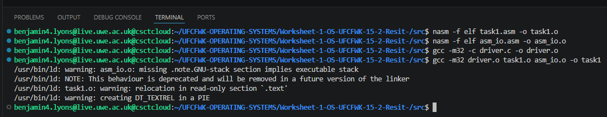
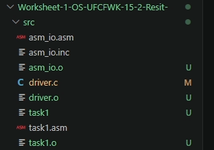
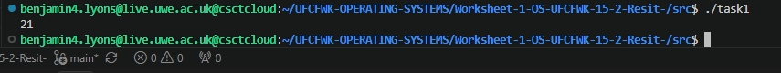
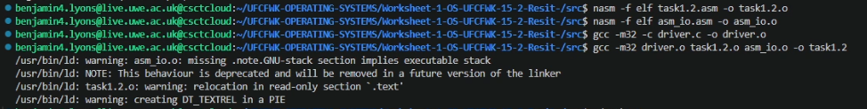
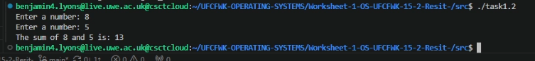
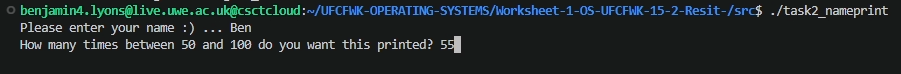
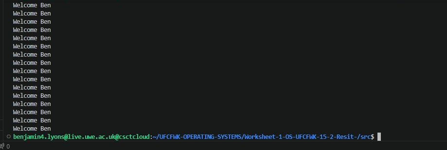
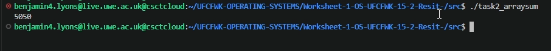
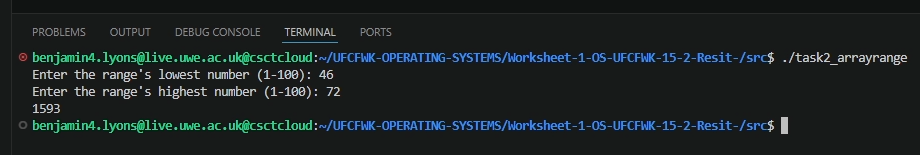

### Task 4 README File

# Operating Systems Worksheet 1:

### Build/Run Commands:

To build all tasks
```
make all
```

To build each task individually
```
make FILENAME
```

To run each task
```
./FILENAME
```

### Task 1.1:
For task 1 I successfully built and ran the provided code from slide 18 of the lecture powerpoint.




Running the provided commands resulted in 4 new files being created. 3 object (.0) files and 1 executable file.



The executable file then output the value of 21 into the terminal.


### Task 1.2:
Task 2 required that I create a new .asm file and paste the code from slide 22 into it.
After doing this, I adapted the commands used for task 1 so they could be used for task 1.2.

```
nasm -f elf task1.2.asm -o task1.2.o
nasm -f elf asm_io.asm -o asm_io.o
gcc -m32 -c driver.c -o driver.o

gcc -m32 driver.o task1.2.o asm_io.o -o task1.2
```

Running these provided me with all the relevant object and executable files for task 1.2.

 

I was then able to run the task 1.2 executable to calculate the sum of 8 and 5.




### Task 2.1:
The goal of this task was to create an assembly program which printed out a welcome message to the user a specified number of times using terminal prompts.

For this to work the program starts by prompting the user to enter their name, then by asking how many times they want the welcome message to be printed.

 
Using the user inputs, the program uses a stack frame, loops, and various CPU registers like "eax", "ebc", and "ecx" to store and process the entered data.

```nasm
asm_main: ;opens stack frame and says where to store user input
    enter 0,0
    mov eax, InputName
    call print_string
    mov ebx, Username
    mov ecx, 25 

ReadName: ;loops for every character the user inputs and stops when enter is pressed.
    call read_char
    cmp al, 10 
    je DoneName 
    mov [ebx], al 
    inc ebx 
    jmp ReadName 
```

The user's data is then checked to be valid (number has to be within 50 to 100) otherwise error code is ran.

If this information is valid then a message saying "Welcome {username}" will print the specified amount between 50 and 100.

 


### Task 2.2:
For task 2 part 2 an assembly program was created to calculate the sum of all the numbers in an array of 1 to 100 and print the final output to the terminal.

To do this I used the ecx register as an index to store and keep track of the arrays current position in the loop and the eax register to track each value of the array.

```nasm
mov ecx, 0 ;index value counts from 0 not 1
mov eax, 1 
```

A loop is then ran to fill the array where each value of each register is increased by increments of 1 every loop.

```nasm
add ecx , 1
add eax , 1 
```

Once complete, a new loop adds up each number of the array 1 at a time until it reaches the 100th value.

The final sum is then printed to the terminal.

 


### Task 2.3:
For task 2.3 the previous program had to be adapted to use user input when determining the range. This meant that new labels and loops had to be created so that the array was dynamic and could work for any range between 1 and 100.

Both the start and end range values are taken from the user via terminal prompts where they are then validated and calculated into the output number.

```nasm
mov eax, EndPrompt ;prompt displayed to user
call print_string
```

```nasm
call read_int ;user integer gets read
mov [EndRange], eax
```

```nasm
mov eax, [EndRange] ;integer validated
cmp eax, 100
jg RangeInvalid
```

```nasm
add eax, [Array + ecx*4] ;adds up all values from array (stored in ram)
```

```nasm
add ecx, 1 ;goes up by 1 every iteration till end number is reached
```

This then outputs the sum of the users specified range.

 


### Task 3:

Task 3 required that I create a makefile to make the process of building the task files faster and easier. 

In order to build all of the task files with one command, I created a target called "all".

```makefile
all: task1 task1.2 task2_nameprint task2_arraysum task2_arrayrange
```

This prevents the need to manually build each tasks executable files individually.

The makefile also contains individual targets for each task, so if needed each executable can be built on its own. These targets consist of the build commands from tasks 1 and 1.2 but modified for every task.

```makefile
#task 2 part 2 build commands
task2_arraysum: task2_arraysum.o driver.o asm_io.o
	gcc -m32 -o task2_arraysum task2_arraysum.o driver.o asm_io.o
task2_arraysum.o: task2_arraysum.asm
	nasm -f elf32 task2_arraysum.asm -o task2_arraysum.o
```

An object wiper target is also used to reset build files and executables if the need to be rebuilt.

```makefile
ObjectWipe:
	rm -f *.o task1 task1.2 task2_nameprint task2_arraysum task2_arrayrange 
```
